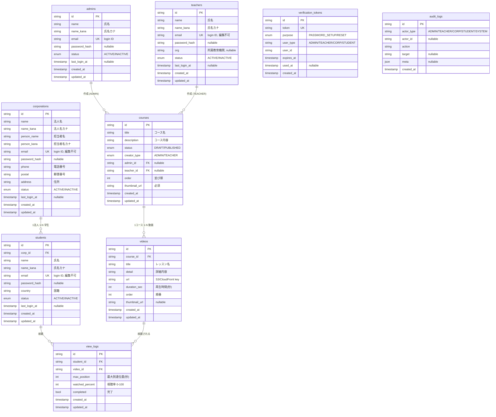

# ASCare LMS — Data Model & ER

介護分野 外国人材向け 動画学習・進捗管理プラットフォーム
Nguồn: `要件定義書 v1.4` (4 role) + 2 詳細設計書 + design ASCare.
Schema thực thi: [`prisma/schema.prisma`](../prisma/schema.prisma) · thuật ngữ: [GLOSSARY.md](GLOSSARY.md).

> **v1.4**: 4 role (+教師 Teacher), Course có 作成者 (admin/teacher), 法人 status 有効/無効 (bỏ 停止) + cascade 法人無効→学生無効, CSV import học sinh (法人), invite-email cho cả 4 role.

## ER Diagram



> ER này **khớp 1:1 với DB thật** (9 bảng / 88 cột). Tên ở ER = snake_case (cột DB); field Prisma tương ứng camelCase (vd `name_kana`↔`nameKana`). `verification_tokens`/`audit_logs` không có FK cứng (dùng `user_type`+`user_id` / `actor_type`+`actor_id`).
> 学生 xem được **mọi** コース công khai → KHÔNG có bảng gán khóa. 法人 chỉ giữ quan hệ với 学生; コース dùng chung.

## Mapping: 要件 mục 8 ↔ design `data.jsx` ↔ Prisma

| 要件 thực thể | design (data.jsx) | Prisma model | Ghi chú thay đổi |
|---|---|---|---|
| 管理者 | `ADMINS` | `Admin` | Bỏ `role/権限` (luôn admin); login = email; set PW trực tiếp |
| 法人 | `CORPS` | `Corporation` | Thêm `nameKana, personKana, postal`; status `有効/無効` (v1.4); login = email |
| 教師 | — (mới v1.4) | `Teacher` | 4-role: tạo/quản khóa của mình; `org` 所属教育機関 |
| 学生 | `STUDENTS` | `Student` | `country`=国籍; login = email; status `有効/無効` |
| (法人スタッフ) | `STAFF` | **— (bỏ)** | 法人 = 1 account nhiều người login → không tách Staff |
| コース | `COURSES` | `Course` | **Bỏ `cat/カテゴリ` và `code` (CARE xx)**; default `非公開`; `thumbnailUrl` bắt buộc |
| 動画 | `videos[]` | `Video` | `title`=レッスン名, thêm `detail`=詳細内容 |
| 視聴ログ | (suy ra từ `prog`) | `ViewLog` | Phương án A — xem dưới |

Bảng phụ thêm: `VerificationToken` (set/reset mật khẩu qua mail), `AuditLog` (FR-13 監査, Should).

## Logic tiến độ (要件 mục 9 — Phương án A)

Tiến độ **KHÔNG lưu trong DB**, tính động từ `ViewLog` (giống các hàm trong `data.jsx`):

```
# 1 video
watchedPct = round(maxPosition / video.durationSec * 100)
completed  = watchedPct >= 100                      # 視聴率100% = 完了

# 1 khóa (chỉ tính video của khóa)
courseProgress(student, course) = (số video completed) / (tổng video) * 100

# tổng thể (trung bình các khóa 公開)
overallProgress(student) = avg( courseProgress trên mọi PUBLISHED course )

# phân loại khóa cho 学生 (マイ進捗)
修了 = courseProgress == 100
受講中 = 0 < courseProgress < 100
未学習 = courseProgress == 0
```

`maxPosition` cũng dùng cho "xem tiếp từ chỗ cũ" (続きから再生).

## Quy tắc nghiệp vụ quan trọng (ràng buộc tầng app)

| Quy tắc | Mô tả |
|---|---|
| 法人 無効 cascade | `Corporation.status = INACTIVE` → mọi 学生 trực thuộc bị chặn login (kiểm ở `authenticate`, không mutate student) |
| Xoá 教師 | Chặn nếu còn コース (`Course.teacher onDelete: Restrict`) |
| Xoá 法人 | Chặn nếu còn 学生 (`onDelete: Restrict`) |
| email bất biến | email (login) của 法人/学生 không sửa khi edit; chỉ admin reset login |
| PW set qua mail | Tạo 法人/学生 → gửi mail (`VerificationToken`) để tự đặt mật khẩu; admin set PW trực tiếp |
| 学生 ↔ コース | Không gán; mọi 学生 xem mọi `PUBLISHED` course |
| Đồng bộ tức thời | 1 CSDL duy nhất → sửa hồ sơ 法人/学生 phản ánh ngay mọi nơi (gồm admin) |

## Login / Auth

- Tất cả role đăng nhập bằng **email + password** (3 bảng tách biệt, email unique trong từng bảng).
- `passwordHash` băm bằng bcrypt/argon2.
- 法人 cho phép nhiều phiên đăng nhập đồng thời (session không khóa single-device).
